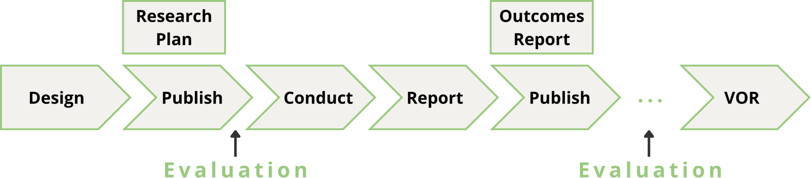
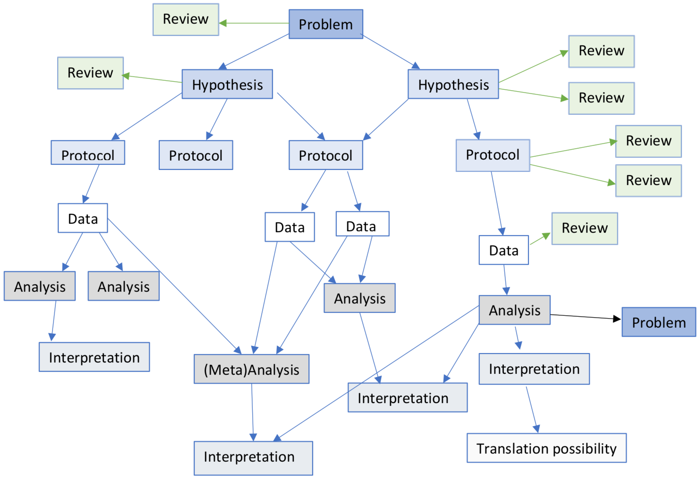
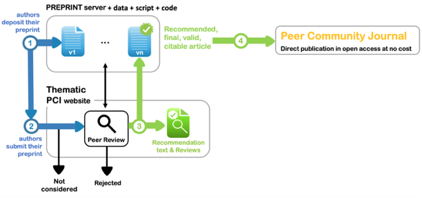

```js
// const response = await fetch("https://api.ror.org/v1/organizations");
// if (!response.ok) throw new Error(`fetch failed: ${response.status}`);
// const ror = await response.json();
// const rco = ror.number_of_results
const rco = 111474
```

# What is our market

---

We consider the global landscape of **research conducting organizations** (RCOs) our target market. We approximate this target market by using [the Research Organization Registry (ROR)](https://ror.readme.io/docs/api-filtering#filter-by-organization-type), which contains ${rco.toLocaleString()} active organizations distributed across the following categories:

1. Education
2. Healthcare
3. Company
4. Archive
5. Nonprofit
6. Government
7. Facility
8. Funder
9. Other

We use a wide definition for RCOs to expand the visibility of research that is being done outside of academic institutions.

## Customer needs

Research conducting organizations do research with limited resources, whose outputs in turn form the basis for attracting new resources. Different types of research conducting organizations have different competitive pressures, but generally speaking, [increased competition is linked to reduced research quality](https://doi.org/10.1093/qje/qjaf010).

Research conducting organizations need to escape pressures that undermine the research process. Conflicts of interest, corner-cutting, and outright fraud exemplify the range of behaviors that can result from such pressures. Increased competition leads to a ["natural selection of bad science"](https://doi.org/10.1098/rsos.160384) that can be undone by reaffirming the research process: [Sound theoretical work](https://doi.org/10.48550/arXiv.2003.00928), openness, and [truncated forms of competition](https://doi.org/10.1098/rsos.190194).

Research conducting organizations need effective means to showcase their accomplishments. Without effective ways to showcase meaningful accomplishments, it is easy to revert to vanity metrics (for example, publication rankings), which in turn are easily gamed, again undermining research. What is meaningful and how to showcase it, depends on the local context.

Research conducting organizations need ways to ensure the quality of their research, while providing sufficient research freedom. Without providing effective means to do research, the range of standards applied throughout an organization can vary widely. This means subpar research processes can also happen more easily. However, being too prescriptive and normative prevents innovative research processes and risks antagonizing an organization's researchers.

## Relevant trends

Related to the needs of research conducting organizations, there are trends that are changing how research is done, managed, and evaluated independently of what is happening at any individual research conducting organization.

Research is increasingly opening up more of the information it produces. This includes sharing data and methods alongside the final report, but also sharing these before the research is completed. This opening up surfaces new needs for research infrastructures. Tax-payer funded research is leading the way on this, under the motto "public money, public results."

Conversely, there is increased attention on knowledge security. Before making things openly available, research conducting organizations are required to securely manage their research, to protect material interests. This trend is further amplified due to global and regional geopolitical instability.

Research conducting organizations are increasingly dependent on a handful of businesses for critical services. [Centralizing pressures enable data surveillance](https://www.sup.org/books/law/data-cartels), risking the ability of research conducting organizations to do their work freely. These options are economical at first, as they are indirectly paid for with data. This risks widen the power gap between research conducting organizations and these businesses, increasing the leverage of a few private actors on the public interest. The security to participate in research freely is threatened this way.

Research is increasingly complex and in need of ways to manage that complexity. Researchers are specializing in specific parts of the research process (for example, research software engineer) yet can struggle to be recognized for their depth of expertise. The volume of research outputs cannot be read by any individual and is out-scaling our technical infrastructures. Currently, [millions of research outputs are at risk of disappearing](https://doi.org/10.1038/d41586-024-03842-z). Larger and more diverse collaborations, aka [big team science](https://doi.org/10.1098/rsos.230235), is more common and requires infrastructure to collaborate without compromising local research standards. These trends are uneven across the different research conducting organizations.

<!-- Research is increasingly delegitimized if the outcomes do not  -->

## Relevant offerings

There are relevant existing projects, products, initiatives already out there. They are helpful for us to consider the range of existing projects and evaluate our approach. We consider existing alternative research platforms, repositories, and research information systems.

<!-- Who is behind it -->
<!-- Core offer -->
<!-- Project Size -->
<!-- Financial Sustainability -->
<details>
 <summary>DSpace</summary>

Provided by Lyrasis, [DSpace](https://dspace.org) is an open-source repository for research outputs.

Launched in the early 2000s, the core project is now ~3FTE, with in-kind contributions provided by member organizations. [For 2024, these in-kind contributions](https://dspace.org/wp-content/uploads/2024/10/AR-2024-DSpace.pdf) amount to ~${Math.round((1777.50+669.58+923.25+420.99+160+144+137+124+96.5+82+75+39.75)/1500)}FTE.

DSpace is funded by [membership fees](https://dspace.org/membership/) and [contributions (financial or in-kind)](https://dspace.org/registered-service-providers/). [Registered Service Providers](https://dspace.org/registered-service-providers/) provide larger contributions.
</details>

<details>
 <summary>DSpace-CRIS</summary>

Provided by [4Science](https://4science.com/about-us/), [DSpace-CRIS is the only open-source research information system](https://github.com/4Science/DSpace). It is an extension of [DSpace](#dspace).

[Started in 2009](https://4science.com/dspace-cris/#:~:text=The%20team%20at%204Science%20created,enhancements%20available%20as%20open%20source.) and according to [their wiki](https://wiki.lyrasis.org/display/DSPACECRIS/DSpace-CRIS+Users), there are at least 138 organizations using DSpace-CRIS. In October 2024, [DSpace and DSpace-CRIS announced that they are investigating a potential merger](https://groups.google.com/g/dspace-community/c/in1oJI-iNa8/m/cutAv3q7AQAJ) ([DSpace-CRIS blog](https://4science.com/dspace-leadership-investigates-dspace-dspace-cris-merger/)).

DSpace-CRIS is financed by providing hosted services (three parts) and other activities provided by 4Science (two parts). This is based on the data from [the 2023 financial report](https://4science.com/wp-content/uploads/2024/04/Balance-sheet-4Science-31st-December-2023_compressed-1.pdf), which indicate 4Science's overall revenue is €3.5 million.
</details>

<details>
 <summary>Lifecycle Journal</summary>

Provided by the Center for Open Science, the [Lifecycle Journal](https://lifecyclejournal.org/?hsLang=en) publishes research plans and outcome reports. It builds on the concept of the Registered Report, where a manuscript gets reviewed in two subsequent stages. Registered reports get published upon completing the research project, whereas the Lifecycle Journal publishes an output after every stage. The Lifecycle Journal provides more granular publishing than existing journal publications.

<figure>
  
  <figcaption>A conceptual model of how the Lifecycle Journal operates.</figcaption>
</figure>

Lifecycle Journal launched in 2025 and is [staffed with ~1-2FTE](https://lifecyclejournal.org/about/). The project has no publications as of February 28th, 2025.

Lifecycle Journal is considered a "research and development project" that has an initial, limited [runtime of three years](https://web.archive.org/web/20250304100525/https://lifecyclejournal.org/?hsLang=en) (estimated: 2025-2028).
</details>

<details>
 <summary>Octopus</summary>

Provided by [Octopus Publishing CIC](https://find-and-update.company-information.service.gov.uk/company/11908269/filing-history), [Octopus](https://octopus.ac) provides a publishing platform for empirical research processes. Specifically, they published research in eight, ordered steps. These steps are represented in the diagram below.

<figure>
  
  <figcaption>An example of modular, stepwise research communication, from the Octopus project (see also https://perma.cc/TA79-YPH9).</figcaption>
</figure>

The platform launched June 2022 and is [open source](https://github.com/JiscSD/octopus). The project has ~1-2FTE staffing ([founder, who is also a member of the House of Lords](https://members.parliament.uk/member/5026/career) and [one project manager](https://www.jisc.ac.uk/contact/staff/tim-fellows)).

Octopus operates solely on grant funding. They got [funded for £650k for 2021-2024](https://www.ukri.org/news/funding-agreed-for-a-platform-that-will-change-research-culture/). It is unclear what will happen to the project when the funding ends. The only indication is in their filings, where they report that they will seek further funding. There is no further indication on their [blog](https://www.octopus.ac/blog).
</details>

<details>
 <summary>Open Science Framework (OSF)</summary>

Provided by [the Center for Open Science](https://cos.io), the [Open Science Framework](https://osf.io) provides storage for research projects. It also provides the option to register snapshots (including DOI) as a way to register predictions. Over the years, it layered the following additional: [Preprints](https://osf.io/preprints?view_only=), [Meetings](https://osf.io/meetings?view_only=), [Registries](https://osf.io/registries?view_only=), and [Institutions](https://osf.io/institutions?view_only=).

The platform launched in 2013 and is [open source](https://www.cos.io/blog).The OSF is staffed with ~14-27FTE ($2.7 million in payroll costs, 2023).

The OSF primarily relies on grant funding. Extrapolating [the Center for Open Science's finances](https://www.cos.io/about/finances) to the OSF, sees ~90% of income being grant funding. In the finances of the first four years there was growing revenue, but afterwards it no longer seemed to be a strategic imperative.
</details>

<details>
 <summary>Peer Community In (PCI)</summary>

[Peer Community In](https://peercommunityin.org) is an organization that provides platform services for communities of researchers to self-organize peer-review. There are [PCI friendly journals](https://peercommunityin.org/pci-friendly-journals-authors/)" that accept this process as if it is their own.

<figure>
  
  <figcaption>A conceptual representation of how PCI works.</figcaption>
</figure>

PCI launched in 2016 and they currently operate 19 communities, processed 1,886 submissions, 4,623 reviews, and recommended 831 submissions. Over [200 organisations support PCI](https://peercommunityin.org/pci-network/). The core team is ~5-9FTE.

[PCI is geared towards gathering sustained funding](https://peercommunityin.org/pci-finances/). This means they do not seek to generate revenue, and do not seek to respond to calls for proposals. They prefer small and consistent funding to reduce volatility in funding cycles.

</details>

<details>
 <summary>Pure</summary>

Provided by Elsevier (parent: RELX Group), [Pure](https://www.elsevier.com/products/pure) is a proprietary research information system. It "aggregates an organisation's research information from numerous internal and external sources into a single platform and ensures the data that drives strategic decisions."

Pure launched in 2002; [Elsevier acquired Pure in 2012](https://web.archive.org/web/20250218094928/https://www.relx.com/media/press-releases/archive/15-08-2012). Our best [staffing estimate is ~100FTE](https://web.archive.org/web/20250108193854/https://www.elsevier.com/products/pure/support).

Pure is a subscription service provided to organizations. We estimate the price between €30-50,000 per year, depending on the size of the organization. Elsevier itself says [Pure is used by >500 organizations](https://www.relx.com/our-business/market-segments/scientific-technical-and-medical), providing [a list of 360 organizations with Pure portals across the web](https://www.elsevier.com/products/pure/in-action).
</details>

<!-- <details>
 <summary>Zenodo</summary>

</details> -->

<!-- ## Potential gaps

Based on the needs, trends, and existing offerings we identify the following gaps. -->

## Business scenario

Accepting that there are approximately ${rco.toLocaleString()} research conducting organizations worldwide, we can model a rough business scenario. Does a business have viable conditions in this market to begin with?

```js
// Parameters
const marketShareLower = .01
const marketShareUpper = .03

const ycvLower = 2500
const ycvUpper = 10000

const salaryLower = 58198.57
const salaryUpper = 81113.255

// Estimates
const revenueCeilingLower = marketShareLower*rco*ycvLower
const revenueCeilingUpper = marketShareUpper*rco*ycvUpper

const teamSizeLower = Math.round(revenueCeilingLower / salaryLower)
const teamSizeUpper = Math.round(revenueCeilingUpper / salaryUpper)

const salesLoadLower = Math.round((salaryLower/ycvLower)/marketShareLower)
const salesLoadUpper = Math.round((salaryUpper/ycvUpper)/marketShareUpper)

const revFteLower = Math.round(revenueCeilingLower / teamSizeLower)
const revFteUpper = Math.round(revenueCeilingUpper / teamSizeUpper)
```

We include the following parameters, with pessimistic and optimistic scenarios:

| Parameter | Pessimistic | Optimistic |
| -- | -- | -- |
| Sales rate | ${marketShareLower * 100}% | ${marketShareUpper * 100}% |
| Yearly customer value | €${ycvLower.toLocaleString()} | €${ycvUpper.toLocaleString()} |
| Mean salary/FTE | €${salaryLower.toLocaleString()} | €${salaryUpper.toLocaleString()} |

These lead to the following estimates for any business in this market:

* **Revenue ceiling:** €${revenueCeilingLower.toLocaleString()}-€${revenueCeilingUpper.toLocaleString()}
* **Full-Time Equivalent (FTE) staffing:** ${Math.round(teamSizeLower)}-${Math.round(teamSizeUpper)}
* **Sales load per FTE:** ${(salesLoadUpper).toLocaleString()}-${(salesLoadLower).toLocaleString()} leads per year
* **Revenue per FTE:** €${revFteLower.toLocaleString()}-€${revFteUpper.toLocaleString()}

This provides an initial indication that the revenue ceiling is sufficient in volume, sales load is going to be high, and profit margins may prove slim. This highlights the high uncertainty of the viability. This increases the urgency for concrete business analytics to improve the understanding of viability moving forward.
